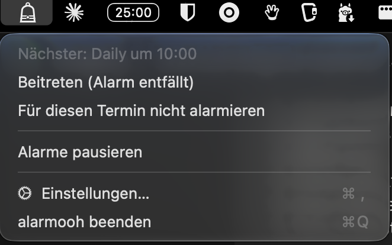

# alarmooh

**Ein Meeting-Wecker für die macOS-Menüleiste: zwei Minuten vor dem Termin läutet eine Glocke – so lange, bis du beitrittst oder sie abstellst.**



alarmooh liest die Termine, die ohnehin in der Kalender-App deines Macs landen, und spielt kurz vor Beginn einen freundlichen, aber hartnäckigen Ton. Ein kleines Fenster unter dem Glocken-Icon bietet den Meeting-Link an: ein Klick, und du bist drin, der Ton ist aus. Kein Backend, keine Konten, kein Netzwerk.

## Installation

Voraussetzungen:

- macOS 14 oder neuer
- Apple Command Line Tools (`xcode-select --install`) – ein vollständiges Xcode ist nicht nötig

```
git clone https://github.com/LorAutumn/alarmooh.git
cd alarmooh
make install
open /Applications/Alarmooh.app
```

Ohne eigenes Signierzertifikat fragt macOS nach jedem neuen Build erneut nach dem Kalenderzugriff. Einmal ein selbstsigniertes Zertifikat anzulegen, behebt das – siehe [Signierzertifikat anlegen](docs/development.md#signierzertifikat-anlegen).

Weitere Befehle: `make run` (starten ohne Installation), `make test`, `make uninstall`.

## Einrichten

1. Beim ersten Start den Kalenderzugriff erlauben.
2. Über das Glocken-Icon „Einstellungen…" öffnen und **mindestens einen Kalender anhaken**. Ohne Auswahl alarmiert alarmooh nichts.
3. Optional: „Bei Anmeldung starten" einschalten.

## Funktionen

**Alarm**
- Standardmäßig zwei Minuten vor Terminbeginn, einstellbar von 1 bis 15 Minuten
- Der Ton wiederholt sich, bis du reagierst, und hört von selbst auf, wenn der Termin schon zwei Minuten läuft
- Die Systemlautstärke wird für den Alarm auf einen Mindestwert angehoben und danach zurückgestellt
- Kein Alarm, wenn der Rechner schläft oder zugeklappt ist

**Beitreten**
- Erkennt Links zu Google Meet, Zoom, Teams, Webex, Jitsi und weiteren Anbietern
- „Beitreten" öffnet den Link und stellt den Ton ab; darunter steht, wohin der Link führt
- Schon früher im Meeting? „Beitreten (Alarm entfällt)" im Menü – dann klingelt es gar nicht erst

**Stummschalten**
- Einen einzelnen Termin oder eine ganze Serie still legen – aus dem Alarm, aus dem Menü oder vorab in der Liste der nächsten zehn Termine
- „Alarme pausieren" schaltet alles ab, bis du es wieder einschaltest
- Ganztägige, abgesagte und abgelehnte Termine alarmieren nie

**Ton**
- Mitgelieferter Ton: fünf aufsteigende Töne, zur Laufzeit erzeugt
- Eigene Tondatei wählbar, „Ton testen" spielt ihn in der eingestellten Lautstärke vor

## Datenschutz

- Kein Netzwerkzugriff, kein Server, keine Konten
- Gelesen werden nur Termine aus den Kalendern, die du ausgewählt hast – für den Alarm die nächsten 24 Stunden, für die Terminliste in den Einstellungen bis 60 Tage voraus
- alarmooh ändert nichts an deinem Kalender. Den Vollzugriff verlangt macOS, weil es keinen reinen Lesezugriff gibt
- Gespeichert werden nur deine Einstellungen und welche Termine du stummgeschaltet hast, lokal in `~/Library/Application Support/alarmooh/`
- Die App ist mit Hardened Runtime signiert, damit kein anderer Prozess über sie deinen Kalender mitlesen kann

## Fehlerbehebung

**macOS fragt nach jedem Build wieder nach dem Kalenderzugriff**
Ohne Zertifikat wird ad hoc signiert, und jede neue Version gilt für macOS als fremde App. Abhilfe: [Signierzertifikat anlegen](docs/development.md#signierzertifikat-anlegen).

**„Kein Kalenderzugriff", obwohl die Systemeinstellungen den Zugriff erlauben**
Berechtigung zurücksetzen und die App über `open` neu starten:

```
tccutil reset Calendar io.github.lorautumn.alarmooh
open /Applications/Alarmooh.app
```

Die Datei `Scripts/alarmooh.entitlements` nicht entfernen – ohne sie lehnt macOS den Kalenderzugriff still ab. Hintergrund in [Bauen und starten](docs/development.md#bauen-und-starten).

**Es passiert gar nichts**
In den Einstellungen ist vermutlich kein Kalender angehakt.

**Die Lautstärke ist nach einem Absturz oben geblieben**
Beim nächsten Start stellt alarmooh sie automatisch zurück.

**`make test` warnt, die swift-testing-Abhängigkeit sei überflüssig**
Mit den reinen Command Line Tools stimmt das nicht; die Warnung kann ignoriert werden.

## Grenzen

- Läuft nur auf macOS und sieht nur Termine, die in der Kalender-App landen
- Die Oberfläche ist auf Deutsch
- Wird die App innerhalb der Vorlaufzeit neu gestartet, kann ein bereits abgestellter Alarm noch einmal kommen

Die vollständige Liste steht in [docs/development.md](docs/development.md#bekannte-grenzen).

## Mehr

- [Entwicklung und Hintergründe](docs/development.md) – Build, Signatur, Hardened Runtime, Dateien, Projektaufbau, Tests
- [Design-Dokument](docs/plans/2026-08-06-alarmooh-design.md) – warum die App so gebaut ist, wie sie gebaut ist

## Lizenz

MIT, siehe [LICENSE](LICENSE). Das gilt für den Code; eine selbst hinterlegte Tondatei bleibt davon unberührt.
